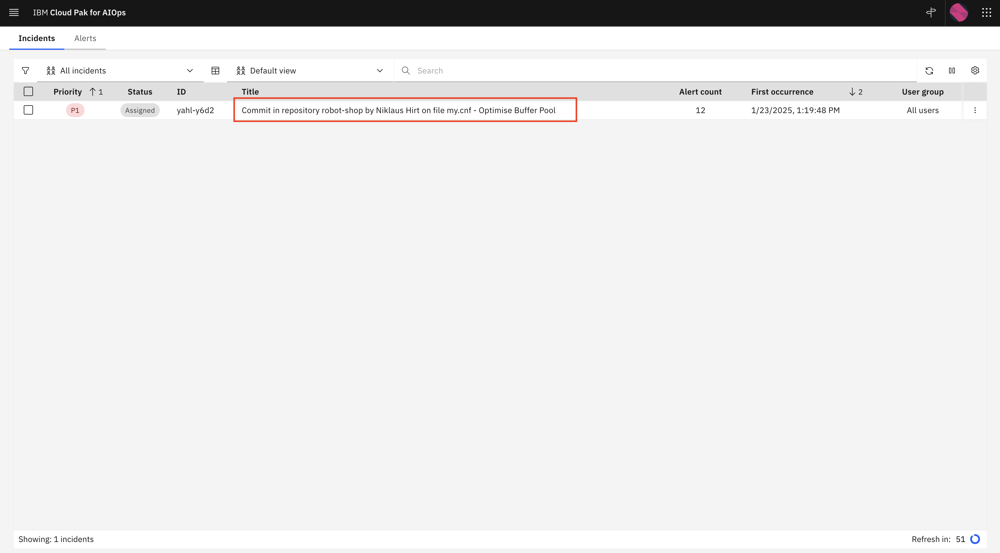
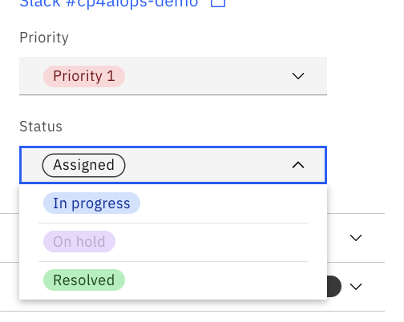

 <h1>IBM AIOps Hands On Lab - Explore Incidents and Alert </h1> 

## Key Terminologies
- **Application**: IBM AIOps brings together the capability to group resources from different data types into applications. Clients can flexibly define an application to meet their business needs. With applications, you can obtain an integrated view of resources to understand inter-dependencies.
- **Event**: A point-in-time statement in IBM AIOps that tells us that something happened somewhere in a client’s environment. It tells us what happened, where it happened, and when it happened.  An event does not have to be exceptional or actionable, it can simply tell us something has happened.  
- **Alert**: An alert in IBM AIOps represents an abnormal condition somewhere in an environment that requires resolution. It tells us what is happening, where it is happening, and when it started to happen.  It may be informed by one or more events. It has a start time and end time. 
- **Incident**: A incident in IBM AIOps represents an outage or reduction in service which is currently impacting customers and requires rapid remediation.  It is created based on one or more trigger alerts that indicate the outage or reduction in service.  Any alert of severity Major or Critical will act as a trigger alert. Other alerts that share the same cause may add context to the incident. 
- **Incident**: An incident in ServiceNow is an event of interruption disruption or degradation in normal service operation. An open incident in ServiceNow implies that the customer is impacted, or it represents the business risk.
- **Topology**: A topology is a representation of how constituent parts are interrelated. In IBM AIOps, an algorithm analyzes how the event nodes are proximate to each other and groups them into a topology-based correlation.

## Understand the Demo UI

Important functionalities:

1. **Open IBMAIOps (login with the provided credentials)**
2. **Clear all existing Stories and Alerts (Green Button)** 
3. **Create an Incident (Red Buttons)**

## Let's start the lab!

In this demo, we are going to explore how IBM AIOps can help your operations team proactively identify, diagnose, and resolve incidents across mission-critical workloads.

You’ll see how:

- IBM AIOps intelligently correlates multiple disparate sources of information such as logs, metrics, events, tickets and topology
- All of this information is condensed and presented in actionable alerts instead of large quantities of unrelated alerts
- You can resolve a problem within seconds to minutes of being notified using IBM AIOps’ automation capabilities

During the demonstration, we will be using the sample application called RobotShop, which serves as a proxy for any type of app. The application is built on a microservices architecture, and the services are running on Kubernetes cluster.

Now let's start the demo.

## 1. Check The RoboShop Application

In this demo I am the application SRE (Site Reliability Engineer) responsible for an e-commerce website called RobotShop, an online store operated by my company. In the middle of the day (when clients make most of the purchases) I received a slack message on my mobile, alerting me that there is some problem with the site.

Let’s verify what’s going on with the RoboShop site. The application is up but displays an error that it cannot get any ratings.

👉🏻 **Click the button with arrow here**

👉🏻 **Click one of the robots**

I know that there are many ratings for each of the products that we sell, so when none are displayed, it means that there is a likely problem with `Ratings` service withing application that may heavily impact client’s purchasing decisions, as well as may be a sign of a wider outage.

## 2. Open your AIOps Environment

👉🏻 **Click IBMAIOps**

Below is the view of your IBM AIOps environment.

### 2.1 Open the Incident
👉🏻 Click the Hamburger on the upper left, choose Incidents

We can see that an **Incident** has been created. The **Incident** includes grouped information related to the incident at hand. It equates to a classic War Room that are usually put in place in case of an outage. 
The **Incident** contains related log anomalies, topology, similar incidents, recommended actions based on past trouble tickets, relevant events, runbooks, and more.

👉🏻 Click on the **Incident**

### 2.2 Examining the Incident

As I said before, the Incident regroups all relevant information concerning the incident at hand that have been identified by IBM AIOps.

1. A list of Alerts that have been identified by IBM AIOps to be the most probable cause
2. The localization of the problem related to the Topology
3. The suggested Runbooks to automatically mitigate the incident
4. Similar Incidents that resemble the incident at hand
5. Status of the Incident - here I can change the status and priority of the incident

### 2.3 Acknowledge the Incident

You can let your colleagues know that you're working on the incident. So let me set it to In Progress.

👉🏻 Click on the **Change Incident Settings.**
👉🏻 Click on the  **Change Status.**
👉🏻 Click on the  **In progress**

### 2.4 Similar Incidents

👉🏻 Click on a similar resolution ticket  

Here's an example how IBM AIOps can be trained to existing tickets 
and extracts the steps used to fix previous incidents (if documented) and recommend resolutions.

These relevant similar incidents help speed up incident resolution. Without these features, your team must manually search for past incidents and resolutions, which is time-consuming.

It can be seen that the problem was related to a Git Commit that massively reduced the resource limits has been commited by DEV on the mysql deployment.

Let me check how the problem was resolved for this incident.

#### Resolution Information

👉🏻 Click on the **Resolution Information** Tab

  

It seems that it was resolved by changing the mysql deployment and a Runbook had been created to mitigate the problem.

To finish up, I will check if the incident was related to an official change.

#### Examine the Change

👉🏻 Click on the **Related Records** Tab
👉🏻 Click on the **i** Button next to **Caused by Change**

We can see that the problem is related to a Change that aims to reduce the footprint of the mysql database.

As it's stil ongoing, chances are high, that the development team recreated a similar problem. Let's try dig a little deeper first.

  

### 2.5 Examining the Alerts

👉🏻 Let's open the **Alerts** Tab. 

  

Notice, that alerts are not sorted by severity, but the AI engine ranked them by relevance. The ones that are likely related to the root cause are at the top. Let’s look at the first row for some more details. 

👉🏻 Click on the first Alert in the list. 

  

In the **Alert details,** you can see different types of groupings explaining why the specific alert was added to the incident.

#### Scope based grouping

👉🏻 **Scope-based grouping**. 

Some alerts were added to the incident because they occurred on the same resource within a short period (default is 15 minutes)

#### Topological grouping

👉🏻  **Topological grouping**. 

Other alerts were grouped because they occurred on the logically or physically related resources. This correlation is using the application topology service that stitches topology information from different sources.

### 2.6 Incident timeline

👉🏻  Click twice on the  **Last occurence** Header. 

  

To understand what happened during the incident, sort the Alerts by occurence. This allows you to understand the chain of events.

* See that the first event was a code change that had been commited to **GitHub**. Hover over the description to get the full text. It seems that the Development Team has reduced the available memory for the mysql database.

Other events are confirming the hypothesis. 
* See the CI/CD process kick in and deploys the code change to the system detected by the Security tool and 
* **Instana** has has detected the memory size change. 

* Then **Functional Selenium Tests** start failing and 
* **Turbonomic** tries to scale-up the mysql database.
* **Instana** tells me that the mysql Pod is not running anymore, the replicas are not matching the desired state.

* IBM AIOps has learned the normal, good patterns for logs coming from the applications. The Incident contains a **Log Anomaly** that has been detected in the ratings service that cannot acces the mysql database.

👉🏻  Click on a Alert line that has **ANOMALY:** in the Type column. Then open the **Metric Anomaly Details** accordion. 

IBM AIOps is also capable of collecting metrics from multiple sources and detecting **Metric Anomalies**. It was trained on hundreds or thousands of metrics from the environment and constructs a dynamic baseline (shown in green). The graphic suddenly turns red which relates to detected anomaly when the database is consuming a higher amount of memory than usual.

## 2.7 Working with Topology

### 2.7.1 Examining the Topology

👉🏻 Go back to the incident and click **Affected Resources** Tab. 

The interface shows the **topology** of the application that is relevant to the incident. IBM IBM AIOps’ topology service delivers a working understanding of the resources that you have in your environment, how the resources relate to each other, and how the environment has changed over time.

You can see that there are some statuses attached to the different resources, marked with colorful dots. Let’s view the details and status of the **mysql** resource with red status. 

👉🏻 Find the resource which displays resource name “**mysql**”. Then, right-click and select **Resource details.** 

  

👉🏻 Click on Tab **Alerts** 

 

The topology service provides operations teams with complete up-to-date visibility over dynamic infrastructure, resources, and services. The topology service lets you query a specific resource for details, and other relevant information. Here we can see all Alerts for the mysql database resource.

### 2.7.2 Topology in-depth

👉🏻 Close the Resource details tabs
👉🏻 Find the resource which displays resource name “mysql”. Then, right-click and select **Open in Topology Viewer.** 

The interface shows the topology surrounding the mysql resource. I can see that the **mysql** deployment is being called by the **ratings** service and that it runs on a certain worker node. 

👉🏻 Change the number of hops to `4` and click **Render**.

The interface shows the topology surrounding the mysql resource. I can see that the mysql deployment is being called by the ratings service.

👉🏻 Right-click om mysql and select **Show last change in timeline** and check **Delta**

 Now I will examine the historical events for the **mysql** component. I can see the **Alerts** that have been raised on the **mysql** resource over time.

## 2.8 Resolving the incident

### 2.8.1 Fixing the problem with runbook automation

👉🏻 Click on the  **Overview**  Tab.

Now that we know what the problem is, let’s correct what has happened. A runbook has been automatically identified but have not been executed. Runbooks are guided steps that IT operations teams use to troubleshoot and resolve problems. Some organizations might call these standard operating procedures or playbooks. When an incident occurs, IBM AIOps matches an appropriate runbook to the problem. The runbook can be set to run automatically when it is matched to an incident, or it can run with user approval and participation. 

Let’s execute the Runbook.

👉🏻 Click on the three dots and click **Run**
👉🏻 Click **Start Runbook**.

👉🏻 Click **Run** in Step 1.

The execution of the runbook can take few minutes. 

The Runbook that we just started kicks off a Playbook on Ansible Tower. We can follow the execution as it connects to the cluster and then scales up memory for the MySQL deployment.

👉🏻 When finished, click **Complete**.

Before confirming that the runbook worked as expected, I should check the RobotShop application to see if it is working as expected.

👉🏻 Open the RobotShop application. Verify that ratings are correctly shown 

Then, we can rate the Runbook.
👉🏻 Rate the Runbook
👉🏻 Then click **Runbook Worked**.

So the runbook has resolved the problem. When we tell IBM AIOps that the Runbook worked, it will learn over time to prioritize and suggest more relevant Runbooks.

### 2.8.2 Resolve the Incident

👉🏻 Click on the dropdown under **Status.**
👉🏻 Click on  **Resolved**

  

Congratulations!
You have explored how IBM AIOps can assist the SRE/Operations team to identify, verify, and ultimately correct an issue with a modern, distributed application running in a cloud-native environment. The presented solution provides automatic application topology discovery, anomaly detection both with metrics and logs, and sophisticated methods of correlation of events coming from different sources. 

> This lab is adapted from [here](https://github.com/niklaushirt/ibm-aiops-deployer/tree/main)
