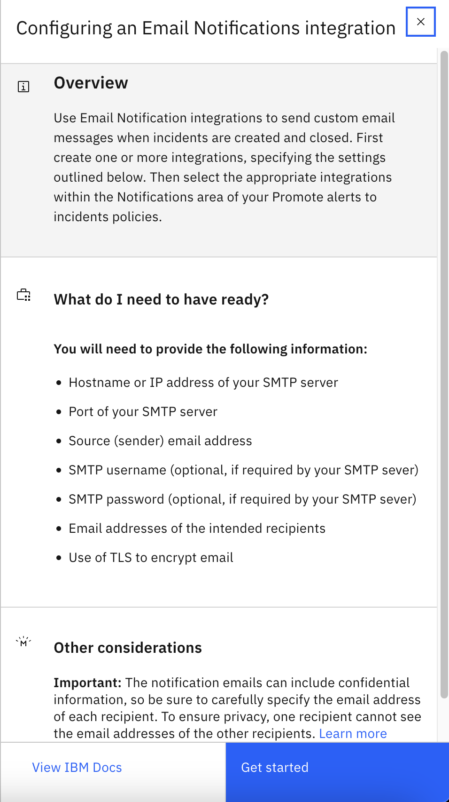
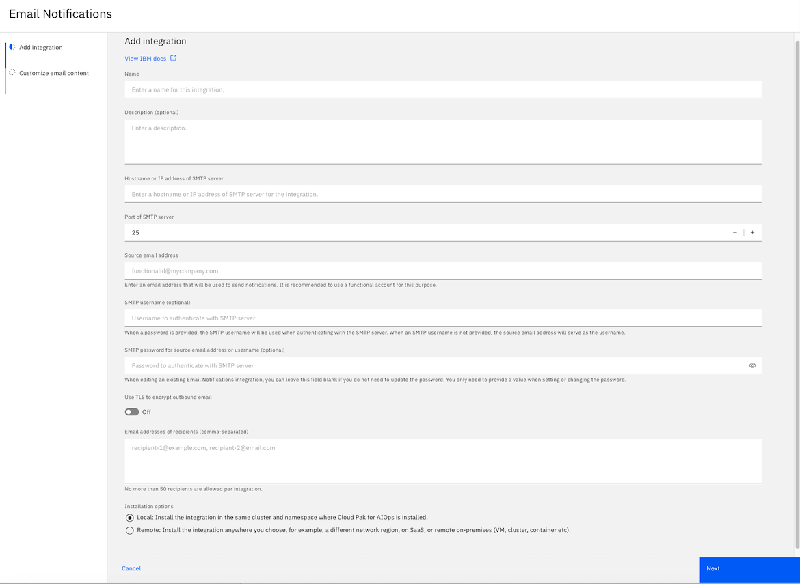
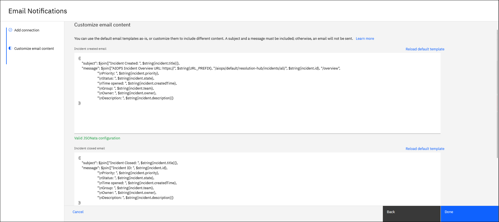

# Creating an email integration

1. Log in to IBM Cloud Pak for AIOps console.

2. Expand the navigation menu (four horizontal bars), then click Define > Integrations

3. On the Integrations page, click Add integration.

4. From the list of available integrations, find and click the Email Notifications tile.

5. On the side-panel, review the instructions and when ready to continue, click Get started.

6. On the Add integration page, define the general integration details:

    - Name: The display name of your integration. You cannot use spaces or special characters in the display name. Use only alphanumeric characters.

    - Description (optional): Optionally, enter a description of the integration.

    - Hostname or IP address of SMTP server: Enter the hostname or IP address of the SMTP server. Note: If running behind a proxy server, enter the proxy server hostname or IP address.

    - Port of SMTP server: Enter the port of the SMTP server.

    - Source email address: The email address that the new incident notifications will be sent from. It is recommended to use a functional email account for this purpose.

    - SMTP username (optional): Enter the SMTP username. When a SMTP username is not provided, the source email address is used as the username.

    - SMTP password for source email address (optional): Optionally, enter an SMTP password for the source email address.

    - Use TLS to encrypt outbound email (optional): Select from On or Off.

    - Email addresses of recipients: Enter the target email addresses (comma-separated). No more than 50 recipients are allowed per integration.

    Important: The notification emails can include confidential information, so be sure to carefully specify the email address of each recipient. To ensure privacy, one recipient cannot see the email addresses of the other recipients.

    Deployment options: Select one of the options, Local or Remote. Local deploys the integration in the same cluster and project (namespace) where IBM Cloud Pak for AIOps is installed. Alternatively, Remote deploys the integration in your chosen location, such as a different network region, on SaaS, or a remote on-premises VM, cluster, or container.

    Note: If you select Remote after adding the integration, you are provided with a bootstrap script to finish the deployment. Download and run the bootstrap script on the remote cluster to complete the deployment.

7. Click Next.

8. Customize the content for both the 'Incident created' and the 'Incident closed' emails. You can use the default email templates as-is, or customize them to include different content. A subject and a message must be included; otherwise, an email will not be sent.

