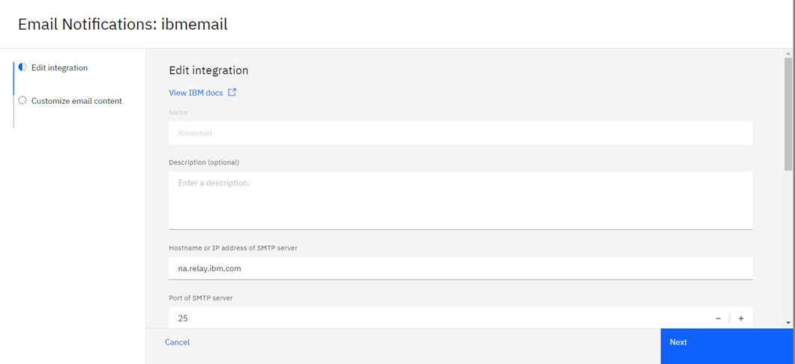
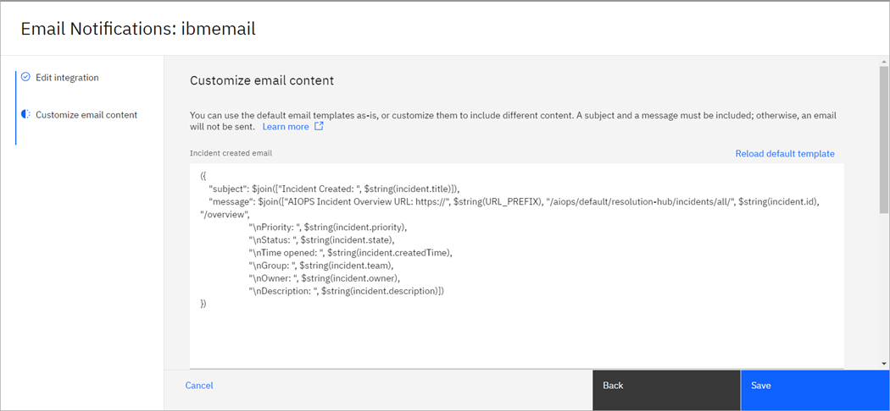

# Editing an email integration

1. Log in to IBM Cloud Pak for AIOps console.

2. Expand the navigation menu (four horizontal bars), then click Define > Integrations.

3. Click the Email Notifications integration type on the Manage integrations tab of the Integrations page.

4. On the Email Notifications page, click the name of the integration that you want to edit. Alternatively, you can click the options menu (three vertical dots) for the integration and click Edit. The integration configuration opens.

5. Edit your integration as required. Click Save when you are done editing.

