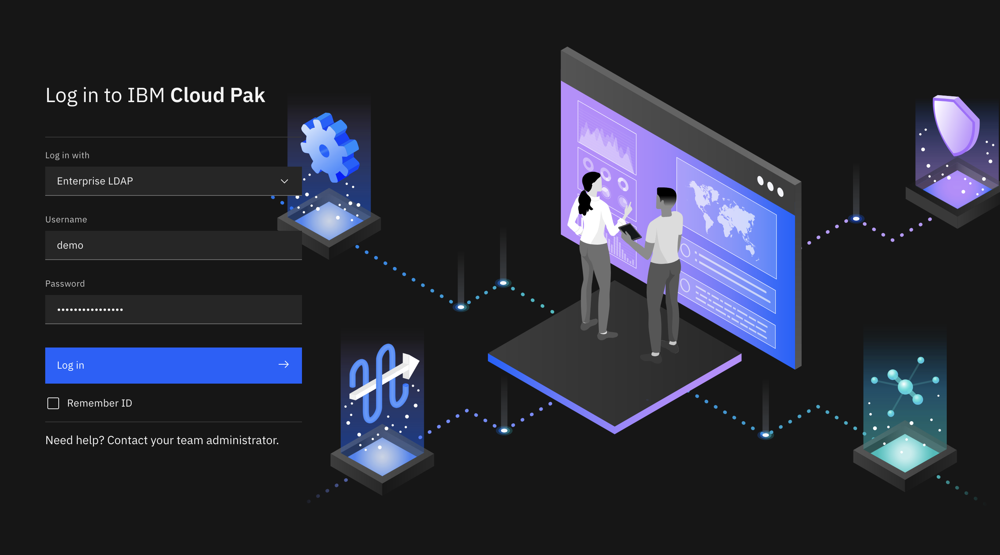
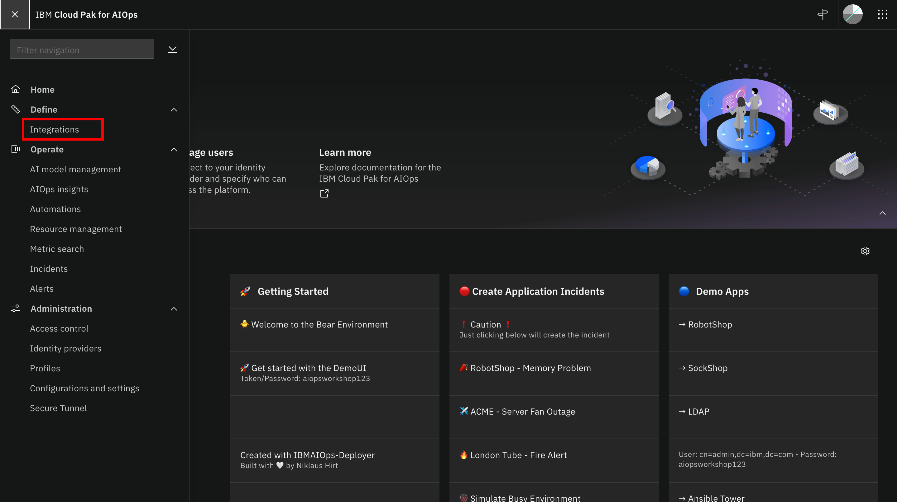

# Deleting an email integration

1. Log in to IBM Cloud Pak for AIOps console.

2. Expand the navigation menu (four horizontal bars), then click Define > Integrations.

3. Click the Email Notifications integration type on the Manage integrations tab of the Integrations page.

4. On the Email Notifications integrations page, click the Delete icon for the integration that you want to delete.

5. Enter the name of the integration to confirm that you want to delete your integration. Then, click Delete.

6. Your integration is deleted in IBM Cloud Pak for AIOps.
