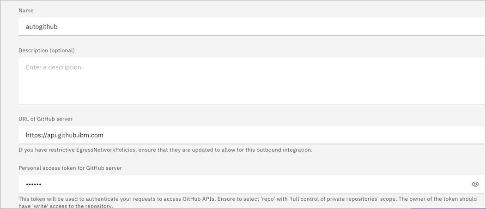
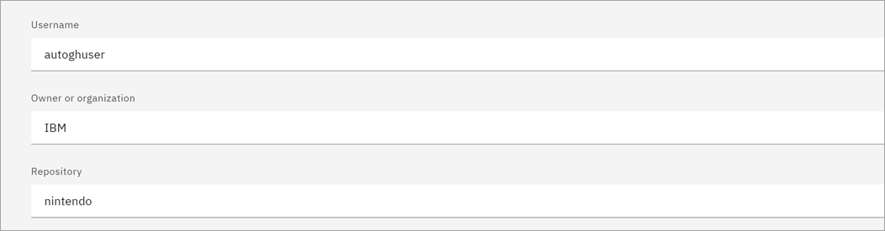
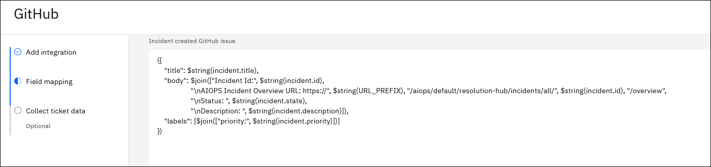
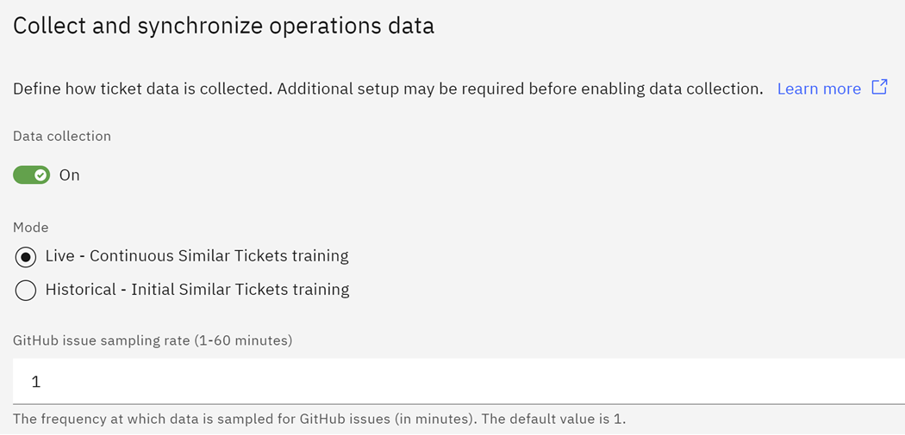

# Creating a GitHub integration

1. Log in to IBM Cloud Pak for AIOps console.

2. Expand the navigation menu (four horizontal bars), then click Define > Integrations

3. On the Integrations page, click Add integration.

4. From the list of available integrations, find and click the GitHub tile.

5. On the side-panel, review the instructions and when ready to continue, click Get started.

6. On the Add integration page, define the general integration details:

    - Name: The display name of your integration. You cannot use spaces or special characters in the display name. Use only alphanumeric characters.

    - Description (optional): Optionally, enter a description of the integration.

    - URL of GitHub server: Enter the URL of the GitHub server, for example https://api.github.com/. If you have any restrictive egress network policies in place, ensure that the policies are updated to allow for this outbound integration.

    

    Important: The selected scope of your GitHub repository must be "repo" with Full control of private repositories. To configure this in your GitHub repository, navigate to your profile > Settings > Developer settings > Personal access tokens.

    - Username: Enter your GitHub username.

    - Owner or organization: Enter the GitHub repository owner or organization.

    - Repository: Enter the GitHub repository.

    

7. Click Next.

8. You can use the default issue template as-is, or customize it to include different information. A title is required or the issue cannot be created. In addition to the fields included by default, you can also specify 'state' and 'assignees' for the incident. Incident 'priority' must be set in the label, otherwise the priority will be appended and not replaced.

The owner of the token must have push access to the repository to set 'labels' and 'assignees' for new issues. Changes to 'labels' and 'assignees' are silently dropped if the user does not have push access to the repository.

Note: $string(URL_PREFIX) reads from the URL_PREFIX environment variable to create the URL. The value for this variable is hostname.

9. Define how ticket data is collected:

    - Data collection: toggle to Off or On. The default is On. Note, if the rate limit for GitHub API calls is reached, an alert is sent to notify users that the connector is sleeping until the reset time from GitHub.

    - Mode: choose between Live or Historical. Live is the frequency at which data is sampled for GitHub issues in minutes (1-60 minutes). The default value is 1. For Historical, select a start date to retrieve closed GitHub issues since their last updated time.

    

10. Click Done. You are redirected to the GitHub integration page.
