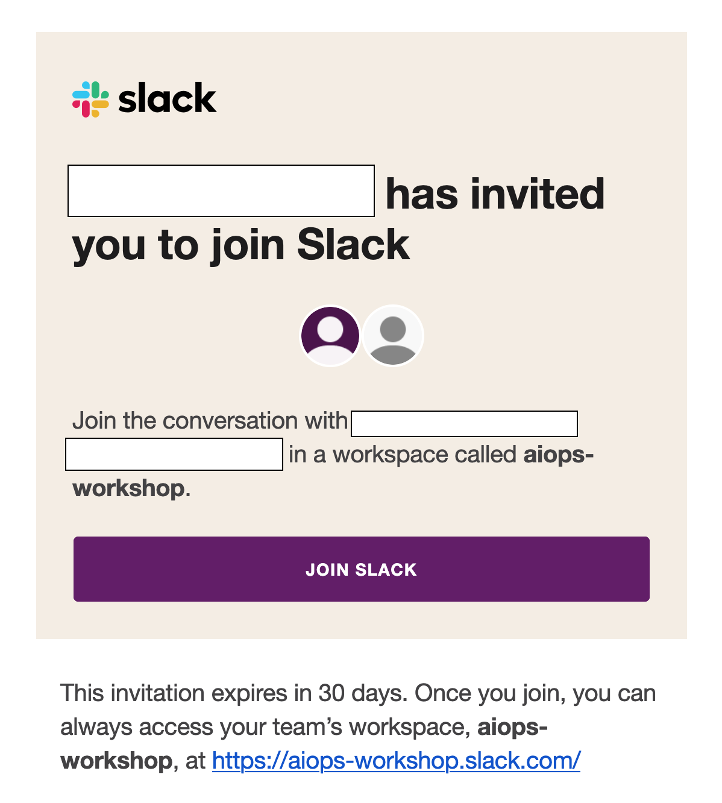

# Prerequisites

1. Open link https://cp-console-ibm-aiops.apps.67861cace9cf903aa87ea3a9.ocp.techzone.ibm.com/, enter username & password
username : demo
password : aiopsworkshop123

2. Join slack from email invitation

3. Join slack channel [#aiops-demo-workshop](https://aiops-workshop.slack.com/archives/C089C63MQLE)

4. Open link https://github.com/Client-Engineering-Indonesia/AIOps-Incubation-Feb25/issues for check issues